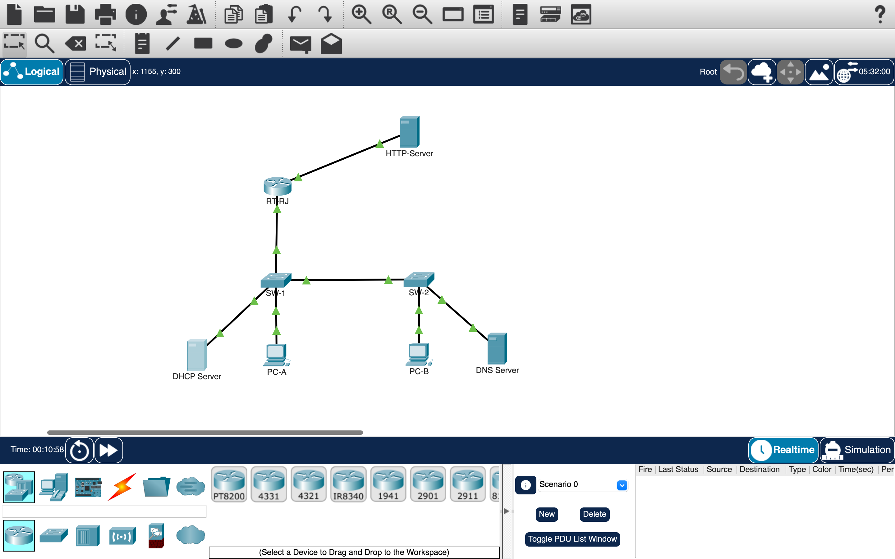

# Network Troubleshooting Lab: From Diagnosis to Resolution (Cisco Packet Tracer)

##  Project Overview
As part of my current coursework in Information Security at Instituto Infnet, I completed a practical lab assignment simulating a real-world NOC/Help Desk incident response scenario.

**The Scenario:** Users at a game development company reported that they were unable to access an external website, `counterstrike.com`. The objective was to apply structured troubleshooting methodologies to identify, diagnose, and resolve the underlying issues preventing user access.

Using the network topology, I conducted a systematic investigation across multiple layers of the OSI model and identified several critical misconfigurations that disrupted the end-to-end communication flow.

---

## Network Topology

---

## Identified Issues & Troubleshooting Methodology

I applied a structured troubleshooting approach aligned with the OSI model layers to isolate and fix each network failure:

### 1. Physical & Data Link Layers (Edge Router)
* **Issue:** The interface on the edge router (`RT-RJ`) was administratively down (`shutdown` status), blocking all traffic to the external network.
* **Diagnosis & Resolution:** Verified the interface status via Cisco IOS CLI and enabled it.
```cisco
# Checking interface status (Before):
RT-RJ# show interfaces GigabitEthernet0/0
GigabitEthernet0/0 is administratively down, line protocol is down

# Corrective commands:
RT-RJ# configure terminal
RT-RJ(config)# interface GigabitEthernet0/0
RT-RJ(config-if)# no shutdown

2. Network Layer (Incorrect IPv4 Addressing)
Issue: The HTTP server hosting the website was configured with an incorrect IP address (200.200.200.222 instead of .202) and a faulty Default Gateway (200.200.200.211 instead of .201), effectively isolating the server from its designated subnet.
Diagnosis & Resolution: I updated the static IPv4 parameters on the server's network configuration panel to match the correct subnet topology.

3. Application Layer (DNS Service Failures)
Issue: The DNS server was completely powered off, preventing any domain name resolution for counterstrike.com. Additionally, the domain name entry mapping contained configuration errors.
Diagnosis & Resolution: Turned on the DNS service device within Packet Tracer and corrected the DNS A-Record mapping to point to the valid server IP.

# DNS Server Adjustments:
- Device Power Status: Changed from OFF to ON
- Service Status: DNS Service -> Enabled
- Resource Record updated:
  * Name: counterstrike.com
  * Type: A Record
  * Address: 200.200.200.202 (Corrected from misconfigured IP)

4. Service & VLAN Inconsistencies
Issue: The HTTP server was restricted to HTTPS connections exclusively, blocking standard HTTP requests. Furthermore, improper VLAN segmentation on the local switches (SW-1 and SW-2) prevented proper traffic forwarding.
Diagnosis & Resolution: Adjusted the web service configurations to accept the required traffic and corrected the switchport access and trunking configurations to restore inter-VLAN routing integrity.

# Example of VLAN and Trunk alignment on switches:
SW-1# configure terminal
SW-1(config)# interface range FastEthernet0/1 - 10
SW-1(config-if-range)# switchport mode access
SW-1(config-if-range)# switchport access vlan 10

 Incident Symptom (The Error)
Before applying the fixes, attempts to reach the domain resulted in a failure, simulating a complete disruption of service for the clients.

 Verification & Results (The Resolution)
By systematically activating the interfaces, correcting the IP addresses and gateway assignments on the HTTP server, booting up and reconfiguring the DNS records, and adjusting the VLAN parameters, full network connectivity was successfully restored.
Below is the verification showing a client PC successfully browsing counterstrike.com:

 The Security Perspective (The CIA Triad)
In Information Security, we frequently focus on access controls and cryptography (Confidentiality and Integrity). However, this exercise highlights the vital importance of Availability—one of the core pillars of the CIA Triad.
A misconfigured network infrastructure can easily mimic a denial-of-service (DoS) condition, drain technical support resources, and create operational blind spots. Mastering infrastructure fundamentals is a prerequisite for effectively securing any corporate environment.

 Tools & Technologies Used
Cisco Packet Tracer (Simulation Environment)
Cisco IOS CLI (Router & Switch Configuration)
OSI Model Methodology (Layer 1, Layer 3, Layer 4, and Layer 7 troubleshooting)
Core Protocols: IPv4 Addressing, DNS (Domain Name System), HTTP/HTTPS, VLANs, and Subnetting.
